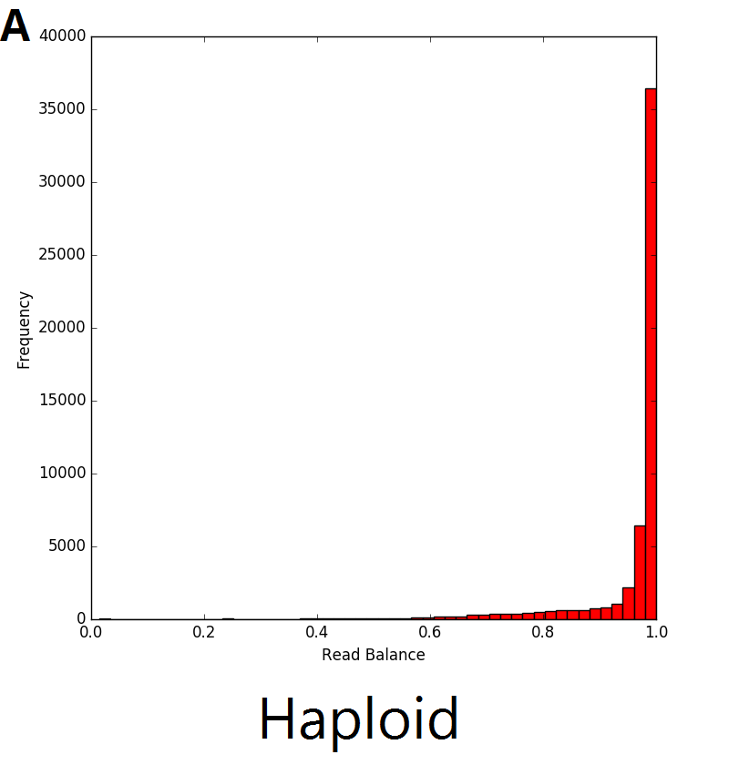

# RBV: Read Balance Validator
## User manual and guide

### Overview
**RBV:** Read Balance Validator is a corroborates copy number variants (CNV) from whole exome and whole genome sequence data. It uses the relative reads for the reference and alternative allele at a given position (the read balance) to determine the probability that a putative CNV is real.

The read balance distribution varies based on the copy number of the genetic sequence. In the example below, single copy deletions (A) result in haploid genetic sequence with no heterozygous single nucleotide polymorphisms (SNPs), thus the distribution ratio of the reads is centred around 1. In regions with diploid sequence (B), the majority of SNPs are homozygous, resulting in a read balance centred around 1. The remaining SNPs in the diploid sequence are heterozygous with the distribution centred around 0.5, representing half of the reads from one allele and half from the other. The majority of SNPs in duplications (C) are also homozygous, with the heterozygous SNPs represented by 2 different peaks in the distribution. The resulting triplicate genomic sequence would result in the distribution seen in C below where there are peaks centred around 0.33 and 0.66 which represent regions with 1 and 2 copies respectively.

Thus, RBV exploits this difference in read distribution to validate CNVs. The python package presented here simultaneously interrogates the probability of multiplications and deletions within a provided list of CNVs. This allows for prioritisation of CNVs in molecular diagnostic bioinformatic pipelines. Additionally, RBV can be used for validating inheritance of causative variants using multiple members of a pedigree.

### Citation

https://www.nature.com/articles/s41598-019-53181-7

### Obtaining
To download RBV, please use git to download the most recent version.  Currently, the RBV is hosted on github, and can be obtained via:

    git clone --recursive https://github.com/whitneywhitford/RBV.git

### Requirements
Python: 2.7

Python packages:
- numpy
- PyVCF
- pysam
- scipy

External Programs:
- SAMtools
- tabix

### Usage
RBV has five required inputs: CNV file containing CNV coordinates, a VCF file, the level of sequencing that was performed (WGS or WES), the variant caller used, and either the reference genome used to align the reads or a list of callable regions in the genome sequence. Therefore an RBV command in its simplest form is:

  	python RBV.py --ref ref.fa --CNV_file CNV.interval_file --vcf variants.vcf --seq_type type --calling_method variantCaller
  
#### Arguments
  ~~~~ -h, --help       show this help message and exit
  --ref REF             Path to reference sequence (including file name).
  --CNV_file CNV_FILE   REQUIRED. Picard-style interval_list containing targets to use in CNV analyses.
		       	      Must be typical interval_list format: 1-based indexing, with the six
		              columns being the chromosome name, start coordinate, stop coordinate,
		       	      strand, and predicted CNV type.
  --gap_file GAP_FILE   Picard-style interval_list containing gaps in the reference to
		              mask for random generation. Must be typical interval_file format:
		              1-based, indexing, with the six columns being the chromosome name,
		              start coordinate, stop coordinate, strand, and type.
  --vcf VCF             REQUIRED. VCF file containing the variants for RBV analyses.
			      VCF must be single individual vcf file but can be derived from joint
			      calling pipeline.
  --output_dir OUTPUT_DIR, -o OUTPUT_DIR
                        Output directory. RBV will create a temporary directory and output file within this
                        directory.
  --sample_id SAMPLE_ID, -id SAMPLE_ID
                        Name/ID of sample - for use in and file naming. Default is sample
  --variant_quality_cutoff VARIANT_QUALITY_CUTOFF, -vqc VARIANT_QUALITY_CUTOFF
                        Consider all SNPs with a quality greater than or equal
                        to this value. Default is 20.
  --read_depth_cutoff", "-rdc"
                        Consider all SNPs with a read depth greater than or equal to this value. Default is 10.
  --readbal_cutoff", "-rbc"
		              For deletion analyses, consider all heterozygous SNPs with a
		              read balance less than this value. Default is 0.65.
  --variant_permutations VARIANT_PERMUTATIONS
                        Number of permutations to use for heterozygous read
                        balance analyses. Default is 10000
  --window_permutations WINDOW_PERMUTATIONS
                        Number of permutations to use for read balance
                        analyses.Default is 1000
  --seq_type            REQUIRED. Type of genome sequencing for RBV analysis.
		              Options: WGS, WES.		
  --interval_file       Picard-style interval_list containing interval coordinates
		              used for variant calling. Must be typical interval_list format: 1-based
		              indexing, with the six columns being the chromosome name, start
		              coordinate, stop coordinate, strand, and type.
		              REQUIRED for if using WES seq_type.
  --calling_method      REQUIRED. Variant calling method used for VCF generation.
		              Options: haplotypecaller, samtools, freebayes, platypus.
  --query_CNVs QUERY_CNVS
                        Number of CNVs to return results for.
~~~~ 

### Contributors

RBV is made by:

- Whitney Whitford
- Klaus Lehnert
- Russell Snell
- Jessie Jacobsen

### Support

Please report any issues or questions by email to whitney.whitford@auckland.ac.nz
